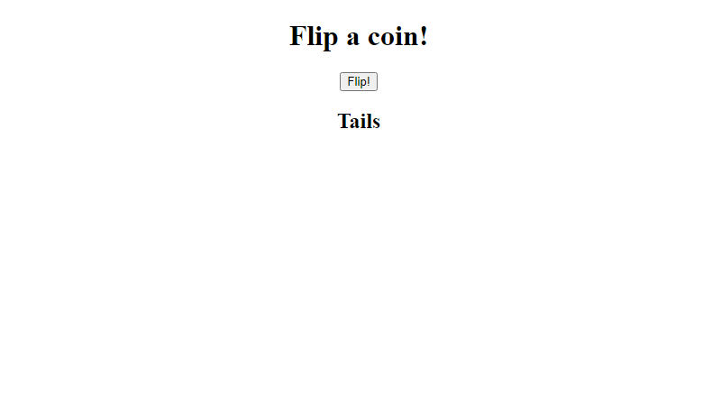

# Bare-bones Node.js Server
No Express, Core Modules Only, Final Destination. A bare-bones Node.js server which incidentally runs a coin flip simulation.

**Link to project:** https://barebones-node-server.herokuapp.com

## How It's Made:

**Tech used:** HTML, JavaScript, and Node.js

This humble server hosts a web page which, when the displayed button is clicked, will make a fetch request to the server for the result of a coin flip calculation. The returned result is then displayed on the page and the whole process can be repeated again as many times as the user desires.

## Optimizations

Functionally speaking, the server performs satisfactory. However, the web page itself could definitely benefit from some styling in the future!

## Lessons Learned:

As my first foray into Node.js, I built this project as simply as possible using only the core Node.js modules. It helped me to get a feel for how to setup a basic Node.js project and the workflow for Node.js applications in general. I also learned a great deal about pushing to Heroku and deploying applications on their platform. (Including the necessity of Procfiles!)

## How To Run It Locally:

1. Ensure that you have Git and Node.js installed.
2. Clone this repository (e.g., with `git clone https://github.com/warnshouse/barebones-node-server.git`).
3. Move into the directory with `cd barebones-node-server`.
4. Install the necessary dependencies with `npm install`.
5. Start the server with `npm start`.
6. Navigate to `localhost:8000` in your web browser and you're set!